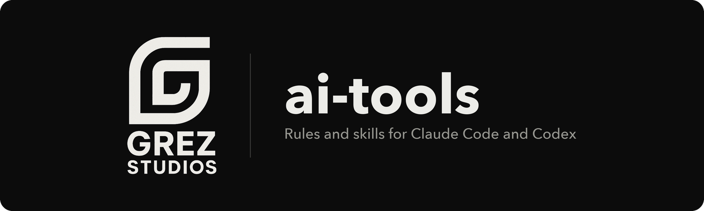

# ai-tools

The rules and skills our coding agents load at Grez Studios. One set of files serves both Claude Code and Codex, and it is built to stay small: about 440 tokens sit in context when a session starts, and everything else loads when a task needs it.

Install the whole setup, or copy a single skill folder.

## How it stays small

An agent pays for every line it loads at startup on every turn, in every repo, whether or not the line applies. So each piece of guidance lives at the cheapest tier that still works.

| Tier | What it holds | Cost at rest |
|---|---|---|
| Always loaded | [`rules/AGENTS.md`](rules/AGENTS.md): writing and git rules, 14 lines | about 180 tokens |
| Loaded on demand | Eight skills. The agent sees one description line for each and reads the body when a task matches | about 260 tokens for all eight |
| Loaded when typed | Three skills that run only when you call them, such as `/retro` | none |

Token counts are estimates at four characters per token.

Two more choices keep it that way:

- Rules for one kind of repo live in that repo. A web app carries its own `AGENTS.md`, so its stack rules never load in a session about taxes or a 3D print.
- A skill that backs up a project file says so in its description. `prd` loads "in a repo with no `prds/README.md`", so a repo with its own copy never reads both.

## What's inside

### Rules

[`rules/AGENTS.md`](rules/AGENTS.md) is the global file. It says that a repo's own `AGENTS.md` wins, how to write prose a person will read, and how to commit.

### Skills

| Skill | What it does | Loads | Source |
|---|---|---|---|
| [`standards`](skills/standards/SKILL.md) | Default stack, code, UI, and security rules for web apps | When a repo has no `AGENTS.md` | Grez Studios |
| [`new-project`](skills/new-project/SKILL.md) | Sets up a new repo, or aligns an old one, with its own copy of the rules | On its own | Grez Studios |
| [`prd`](skills/prd/SKILL.md) | PRD template, statuses, and how to build against one | When a repo has no `prds/README.md` | Grez Studios |
| [`convex`](skills/convex/SKILL.md) | Convex schema, query, mutation, and auth patterns | When a repo has no `docs/convex.md` | Grez Studios |
| [`design-plan`](skills/design-plan/SKILL.md) | The per-project design plan: `DESIGN.md` plus a `design/` folder | When setting a design direction | Grez Studios |
| [`setup-hosting`](skills/setup-hosting/SKILL.md) | GitHub repo, Vercel project, environment variables, production deploy | `/setup-hosting` | Grez Studios |
| [`pr`](skills/pr/SKILL.md) | Writes a PR body that is fast to review | On its own | [mattpocock/skills](https://github.com/mattpocock/skills) |
| [`retro`](skills/retro/SKILL.md) | Reviews a coding session and proposes fixes to the agent's environment | `/retro` | [mattpocock/skills](https://github.com/mattpocock/skills) |
| [`writing-for-agents`](skills/writing-for-agents/SKILL.md) | Reference for writing skills and rules files | On its own | [mattpocock/skills](https://github.com/mattpocock/skills) |
| [`unslop`](skills/unslop/SKILL.md) | Removes AI tells from a piece of writing | `/unslop` | [pstack](https://github.com/cursor/plugins/tree/main/pstack) |
| [`frontend-design`](skills/frontend-design/SKILL.md) | Guidance for distinctive visual design | On its own | [claude-plugins-official](https://github.com/anthropics/claude-plugins-official) |

"On its own" means the agent decides from the description. A slash name means the skill runs only when you type it. In Codex the prefix is `$`, as in `$retro`, and `unslop` can also load on its own there because upstream ships no Codex policy file.

## Install

You need git and bash. Tested on macOS.

```bash
git clone https://github.com/grezxune/ai-tools.git ~/ai-tools
~/ai-tools/scripts/install.sh
```

`install.sh` makes four symlinks, so an edit in the clone takes effect in the next session:

| Link | Points to | Read by |
|---|---|---|
| `~/.claude/CLAUDE.md` | `rules/AGENTS.md` | Claude Code |
| `~/.codex/AGENTS.md` | `rules/AGENTS.md` | Codex |
| `~/.claude/skills` | `skills/` | Claude Code |
| `~/.agents/skills` | `skills/` | Codex |

The script is safe to re-run. If a real file or folder already sits at one of those paths, it is moved to `<name>.bak.<timestamp>` first. That means an existing skills folder is set aside, not merged. To keep your own skills, copy single folders instead:

```bash
cp -R ~/ai-tools/skills/prd ~/.claude/skills/
```

To uninstall, delete the four links.

## Each repo carries its own rules

The global file is short because the working rules live in each project. `new-project` writes them into the repo, so a teammate or a cloud session with none of this installed still follows them.

```
your-app/
├── AGENTS.md          stack, code, UI, security, and git rules, under 80 lines
├── CLAUDE.md          one line: @AGENTS.md
├── DESIGN.md          the design plan, 80 lines at most
├── design/            assets, references, mockups, decisions.md
├── prds/README.md     the PRD template
├── docs/convex.md     Convex patterns, when the project uses Convex
└── CHANGELOG.md
```

Each copy is a snapshot the project owns from then on. The skills here stay the source for new projects and the fallback for repos that have no copy yet.

### The design plan

`DESIGN.md` names each design token and says when to use it. Token values stay in `globals.css` and component specs stay in the component code, so nothing is written down twice and the plan is short enough to read before every UI change. Logos, reference screenshots, and mockups go under `design/`, and each one gets a line in the plan so an agent opens only the file a task needs. The section order follows the [DESIGN.md format](https://github.com/google-labs-code/design.md).

## Update the vendored skills

Five skills come from other repos. [`skills/SOURCES`](skills/SOURCES) lists each one with its upstream repo, path, and pinned commit.

```bash
scripts/update-skills.sh
git diff skills
```

The script replaces those folders with upstream HEAD and rewrites the pins. It commits nothing. Read the diff before you commit, because a skill is instructions an agent will follow. Vendored folders match upstream byte for byte, so local changes belong in another skill.

## Make it yours

The rules are written in first person because they are one person's instructions to their agents. Fork the repo and change them.

- Put a rule in `rules/AGENTS.md` only when it applies in every repo you open.
- Write a skill description as a trigger: what the skill is, then the cases that should load it. That line is the only part that costs context at rest.
- For a skill you only run by hand, set both switches. The first is read by Claude Code and the second by Codex.

```yaml
# SKILL.md frontmatter
disable-model-invocation: true
```

```yaml
# agents/openai.yaml
policy:
  allow_implicit_invocation: false
```

[`writing-for-agents`](skills/writing-for-agents/SKILL.md) covers the rest, and [`AGENTS.md`](AGENTS.md) has the rules for working on this repo.

## Layout

```
rules/AGENTS.md            global rules, linked as CLAUDE.md and AGENTS.md
skills/                    one folder per skill
skills/SOURCES             upstream repo, path, and pin for each vendored skill
scripts/install.sh         links everything into your home directory
scripts/update-skills.sh   re-pulls the vendored skills
licenses/                  license texts for the vendored skills
assets/                    README images
AGENTS.md                  rules for working on this repo
```

## Credits and license

Our own files are MIT licensed. See [LICENSE](LICENSE).

The vendored skills keep their upstream licenses:

| Skill | Author | License |
|---|---|---|
| `pr`, `retro`, `writing-for-agents` | [Matt Pocock](https://github.com/mattpocock/skills) | MIT, [licenses/mattpocock-skills.txt](licenses/mattpocock-skills.txt) |
| `unslop` | [Lauren Tan](https://github.com/cursor/plugins/tree/main/pstack), from pstack | MIT, [licenses/pstack.txt](licenses/pstack.txt) |
| `frontend-design` | [Anthropic](https://github.com/anthropics/claude-plugins-official) | Apache-2.0, [skills/frontend-design/LICENSE.txt](skills/frontend-design/LICENSE.txt) |

`pr` builds on Dex Horthy's `show-me` skill, credited in [skills/pr/CREDITS.md](skills/pr/CREDITS.md).
